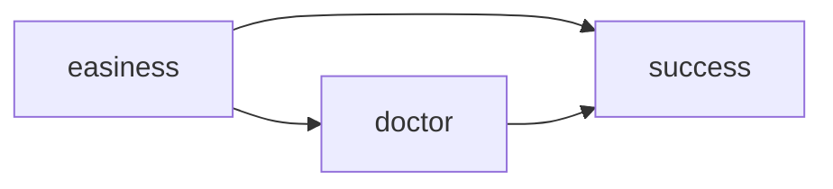
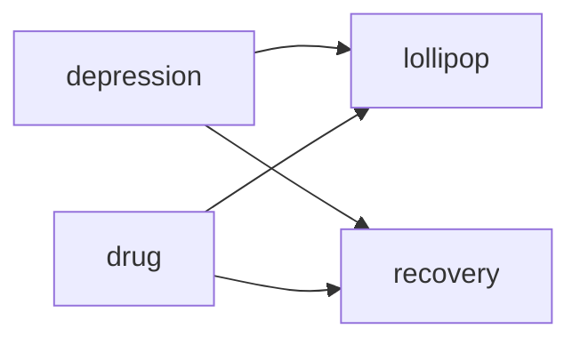
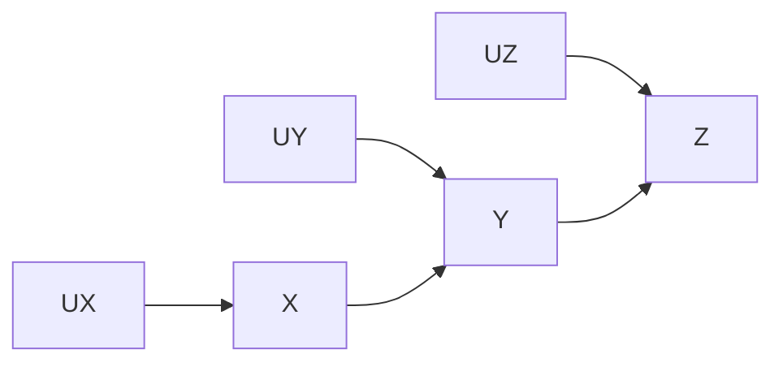

# 1.1

## 1.2.1
### (a)
Marriage is probably not the cause of income. It is likely that higher income leads to higher chance of marriage.

### (b)
It is clear that the number of fire fighters is not the cause of the number of fires. It is likely that the increasing number of fires causes the more number of fire fighters.

### (c)
It is clear that people are not late to meetings because they hurry. It is likely that they hurry because they are about to late.

## 1.2.2
| | Tim | Frank |
| ---- | ---- | ---- |
| right-handed | 38 / 80 | 10 / 20 |
| left-handed | 2 / 20 | 20 / 80 |
| total | 40 / 100 | 30 / 100 |

## 1.2.3
### (a)
Since the stone size is the cause of both treat selection and recovery, patients should examine the stone size-specific data.

### (b)
Easiness of the surgery is the cause of both the doctor and the success rate. Thus, you should examing the success rate of each doctor for the easy and difficult caases separately.

## 1.2.4 (TODO)

### (c)

## 1.3.1
variables: "receive drug or not", "receive lollipops or not", "depressed or not", "recover or not".

events: combination of variables and values, such as "receive drug and does not recover"

## 1.3.2
$$
\begin{aligned}
P(\mathrm{High ~ School}) &= \frac{(231 + 189)}{2440} \fallingdotseq 0.17 \\
P(\mathrm{High ~ School ~ OR ~ Female}) &= \frac{(231 + 1260)}{2440} \fallingdotseq 0.61 \\
P(\mathrm{High~School ~ \vert ~ Female}) &= \frac{189}{1260} = 0.15 \\
P(\mathrm{Female ~ \vert ~ High ~ School}) &= \frac{189}{231 + 189} = 0.45 \\
\end{aligned}
$$

## 1.3.3
### (a)
$$
\begin{aligned}
P(\mathrm{craps ~ \vert ~ 11}) &= \frac{P(\mathrm{11 ~ \vert ~ craps})P(\mathrm{craps})}{P(11)} \\
&= \frac{\frac{1}{18} \times \frac{1}{3}}{\frac{1}{18} \times \frac{1}{3} + \frac{1}{38} \times \frac{2}{3}} \\
&\fallingdotseq 0.51
\end{aligned}
$$

### (b)
$$
\begin{aligned}
P(\mathrm{roulette ~ \vert ~ 10}) &= \frac{P(\mathrm{10 ~ \vert ~ roulette})P(\mathrm{roulette})}{P(10)} \\
&= \frac{\frac{1}{38} \times \frac{1}{3}}{\frac{1}{38} \times \frac{1}{3} + \frac{1}{12} \times \frac{2}{3}} \\
&\fallingdotseq 0.14
\end{aligned}
$$

## 1.3.4
### (a), (b)
omit
### (c)
$$
\begin{aligned}
P(C _ D = B \vert C _ U = B) &= \sum _ {i \in \{1, 2, 3\}} P(C _ D = B, I = i \vert C _ U = B) \\
&= \frac{\sum _ {i \in \{1, 2, 3\}} P(C _ D = B, I = i, C _ U = B)}{P(C _ U = B)} \\
&= \frac{\frac{1}{3}}{\frac{1}{2}} \\
&= \frac {2}{3}
\end{aligned}
$$

## 1.3.5
Let $X$ be a door behind which the car exists. Let $Y$ be a door that the host opens. We can assume the participant chose the door $A$ without loss of generality.

$$
\begin{aligned}
P(X = A \vert Y = B) &= \frac{P(Y = B \vert X = A)P(X = A)}{P(Y = B)} \\
&= \frac{\frac{1}{2} \times \frac{1}{3}}{\frac{1}{2} \times \frac{1}{3} + 0 + 1 \times \frac{1}{3}} \\
&= \frac{1}{3}
\end{aligned}
$$

Since $P(X=B \vert Y=B) = 0$, $P(X=C \vert Y=B) = \frac{1}{3}$ is derived. The same thing holds if you change $Y=B$ to $Y=C$. Thus, the probability of winning the car will be doubled if you change the door.

## 1.3.6
### (a)
$$
\begin{aligned}
\sigma _ {XY} ^ 2 &= \mathbb{E}[(X - \mathbb{E}[X])(Y - \mathbb{E}[Y])] \\
&= \mathbb{E}[XY] - \mathbb{E}[X]\mathbb{E}[Y] \\
&= \mathbb{E}[X]\mathbb{E}[Y] - \mathbb{E}[X]\mathbb{E}[Y] \\
&= 0 \\
\rho _ {XY} &= \frac{\sigma _ {XY}}{\sigma _ X \times \sigma _ Y} \\
&= \frac{0}{\sigma _ X \times \sigma _ Y} \\
&= 0
\end{aligned}
$$

### (b)
Consider the following distribution

$$
\forall (x, y) \in \{(-1, -1), (-1, 1), (0, 0), (1, -1), (1, 1)\}, P(X=x, Y=y) = \frac{1}{5} 
$$

It is clear that $X$ and $Y$ are highly dependent. Since, $\mathbb{E}[X] = \mathbb{E}[Y] = \mathbb{E}[XY] = 0$, 

$$
\rho _ {XY} = \frac{\sigma _ {XY}}{\sigma _ X \times \sigma _ Y} = \frac{0 - 0 \times 0}{\sigma _ X \times \sigma _ Y} = 0
$$

## 1.3.7
### (a)
$$
\begin{aligned}
P(X=1) &= \frac{3}{4}, P(X=0) = \frac{1}{4} \\
P(Y=1) &= \frac{1}{2}, P(Y=0) = \frac{1}{2} \\
P(X=1, Y=1) &= \frac{1}{4}, P(X=1, Y=0) = \frac{1}{2}, P(X=0, Y=1) = \frac{1}{4}, P(X=0, Y=0) = 0\\
P(Y=1 \vert X=1) &= \frac{1}{3}, P(Y=0 \vert X=1) = \frac{2}{3}, P(Y=1 \vert X=0) = 1, P(Y=0 \vert X=0) = 0\\
P(X=1 \vert Y=1) &= \frac{1}{2}, P(X=0 \vert Y=1) = \frac{1}{2}, P(X=1 \vert Y=0) = 1, P(X=0 \vert Y=0) = 0
\end{aligned}
$$

### (b)
$$
\begin{aligned}
\mathbb{E}[X] &= \frac{3}{4} \\
\mathbb{E}[Y] &= \frac{1}{2} \\
\mathbb{E}[Y \vert X=1] &= \frac{1}{3}, \mathbb{E}[Y \vert X=0] = 1\\
\mathbb{E}[X \vert Y=1] &= \frac{1}{2}, \mathbb{E}[X \vert Y=0] = 1\\
Var(X) &= \frac{3}{16} \\
Var(Y) &= \frac{1}{4} \\
Cov(X, Y) &= -\frac{1}{8} \\
\rho _ {XY} &= - \frac{1}{\sqrt{3}}
\end{aligned}
$$

### (c)
$$
\mathbb{E}[X \vert Y=1] = \frac{1}{2}
$$

### (d)
$$
\mathbb{E}[Y \vert X=1] = \frac{1}{3}
$$

### (e)
Dependent since $P(X=1) \neq P(X=1 \vert Y=1)$

## 1.3.8
### (a)
$$
\begin{aligned}
\mathbb{E}[X] &= 3.5 \\
\mathbb{E}[Y] &= 7.0 \\
\mathbb{E}[Y \vert X=x] &= x + 3.5 \\
\mathbb{E}[X \vert Y=y] &= 0.5y \\
Var(X) &\fallingdotseq 2.92 \\
Var(Y) &\fallingdotseq 5.83 \\
Cov(X, Y) &\fallingdotseq 2.92  \\
\rho _ {XY} &= \frac{1}{\sqrt{2}} \\
Cov(X, Z) &= 0
\end{aligned}
$$

### (b)
Executing 1_3_8.py will give the answers

### (c)
$$
\mathbb{E}[Y \vert X=3] = 6.5
$$

### (d)
$$
\mathbb{E}[X \vert Y=4] = 2
$$

### (e)
$$
\mathbb{E}[X \vert Y=4, Z=1] = 3
$$

When, $Y$ and $Z$ are specified, the value of $X$ is uniquely determined to be 3. Thus, the result is different from (d).

## 1.3.9
### (a)
$$
\begin{aligned}
\begin{cases}
\mathbb{E}[Y] &= a + b\mathbb{E}[X] + \mathbb{E}[\epsilon] \\
\mathbb{E}[XY] &= a\mathbb{E}[X] + b\mathbb{E}[X^2] + \mathbb{E}[\epsilon X]
\end{cases}
\end{aligned}
$$

よって、$b = \frac{\sigma _ {XY}}{\sigma _ X ^ 2}$

### (b)
$$
\begin{aligned}
R _ {YX \cdot Z} &= 1 \\
R _ {XY \cdot Z} &= 1 \\
R _ {YZ \cdot X} &= 1 \\
R _ {ZY \cdot X} &= 1 \\
R _ {XZ \cdot Y} &= -1 \\
R _ {ZX \cdot Y} &= -1 
\end{aligned}
$$

## 1.4.1
### (a)
W, Y

### (b)
W, X, Y

### (c)
Y, Z

### (d)
T, Y, Z

### (e)
XWYT, XWYZT, XWZT, XWZYT, XYT, XYZT, XYWZT

### (f)
XWYT, XWYZT, XWZT, XYT, XYZT

## 1.5.1
### (a)

### (b)
$$
\mathbb{E}[Z \vert Y=3] = \frac{3}{16}
$$

### (c)
$$
\mathbb{E}[Z \vert X=3] = \frac{1}{16}
$$

### (d)
$$
\mathbb{E}[Z \vert X=1, Y=3] = \frac{3}{16}
$$

### (e)
#### (i)
$$
\begin{aligned}
p(X=x \vert Y=2) &= \frac{p(Y=2 \vert X=x)p(X=x)}{p(Y=2)} \\
&= \frac{\frac{1}{\sqrt{2 \pi}} \exp(-\frac{(2-\frac{x}{3})^2}{2})\frac{1}{\sqrt{2 \pi}} \exp(-\frac{x^2}{2})}{p(Y=2)} \\
&= \frac{\frac{1}{2 \pi} \exp(-\frac{(x-\frac{3}{5})^2}{\frac{9}{5}} - \frac{9}{5})}{p(Y=2)} \\
&= N(\frac{3}{5}, \frac{3}{\sqrt{10}})
\end{aligned}
$$

従って、 $\mathbb{E}[X \vert Y=2] = \frac{3}{5}$

#### (ii)
$$
\begin{aligned}
p(Y=y \vert X=1, Z=3) &\propto p(Z=3 \vert Y=y, X=1)p(Y=y \vert X=1)p(X=1) \\
&\propto \exp(-\frac{(3-\frac{y}{16})^2}{2})\exp(-\frac{(y-\frac{1}{3})^2}{2})\exp(-\frac{1^2}{2})
\end{aligned}
$$

従って、$p(Y=y \vert X=1, Z=3) = N(\frac{400}{777}, \frac{256}{257})$

よって、$\mathbb{E}[Y \vert X=1, Z=3] = \frac{400}{777} \fallingdotseq 0.51$