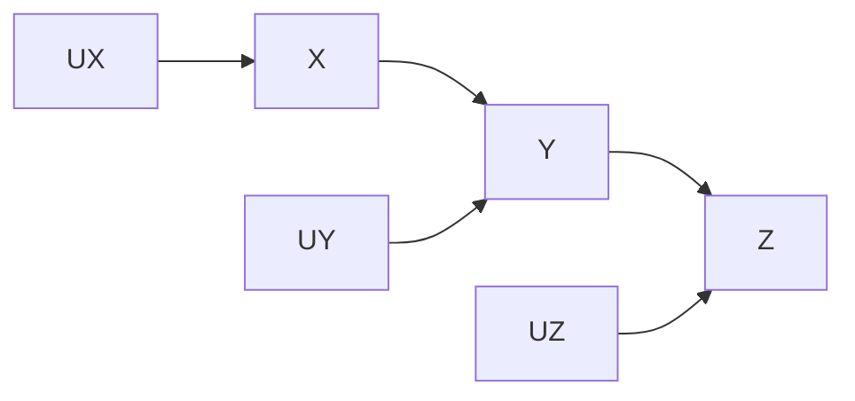
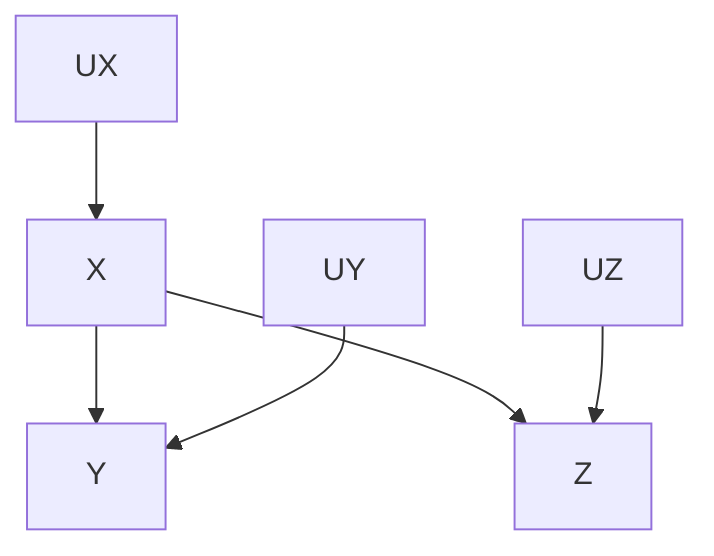
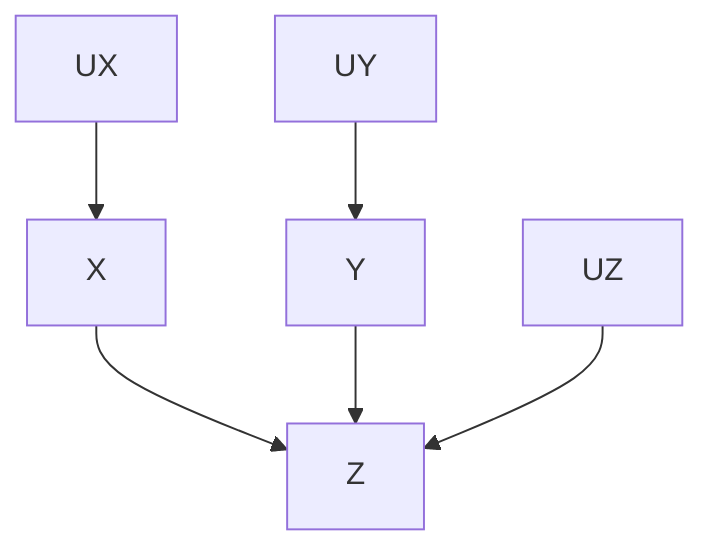

## 2.2 Chains and Forks
- From a graphical causal model without information of a function corresponding to each edge, we can learn which variables are independent and which variables are conditionally independent.
### Chain

- Assumption: UX, UY, and UZ are independent
- It is **likely** that X and Y are dependent
- It is **likely** that Y and Z are dependent
- It is **likely** that X and Z are dependent
    - There are counter examples for this, which is called "intransitive cases"
- X and Z **are** independent conditioned on Y
- Rule 1: conditional independence in chains
    - X and Y are conditionally independent given Z, if there is only one unidirectional path between X and Y and Z is any set of variables that intercepts that path.
### Fork

- Assumption: UX, UY, and UZ are independent
- It is **likely** that X and Y are dependent
- It is **likely** that X and Z are dependent
- It is **likely** that Y and Z are dependent
- Y and Z **are** independent conditioned on X
- Rule 2: conditional independence in forks
    - If X is a common cause of Y and Z (i.e., X is an ancestor of Y and Z), and there is only one path between Y and Z, then Y and Z are independent conditional on X.

## 2.3 Colliders

- Assumption: UX, UY, and UZ are independent
- It is **likely** that X and Z are dependent
- It is **likely** that Y and Z are dependent
- X and Y **are** independent
- It is **likely** that X and Y are dependent conditioned on Z
- Rule 3: conditional independence in colliders
    - If Z is the collision node between X and Y, and there is only one path between X and Y, then X and Y are unconditionally independent but are dependent conditional on Z and any descendants of Z.

## 2.4 d-separation
- X and Y are d-separated if every path between them is blocked
- X and Y are d-connected if there is an unblocked path between them
- Block
    - If we are not conditioning on any variable, only colliders can block a path
    - If we are conditioning on a set of nodes Z, the following kinds of nodes can block a path
        - A collider that is not in Z, and that has no descendants in Z
        - A chain or fork whose middle node is in Z
- d-separation: A path p is blocked by a set of nodes Z iff
    - p contains a chain or a fork such that the middle node is in Z
    - or
    - p contains a collider such that the collision node is not in Z and no descendant of the collision node is in Z

## 2.5 Model Testing and Causal Search
- Assume a possible graph G tells us that A and B are independent conditioned on C, but the estimated probabilitis from data shows that A and B are dependent conditioned on C. Then, we can reject G as a possible causal model.
- If every d-separation condition in the model matches a conditional independence in the data, then no further test can refute the model.
- Problems of a statstical hypothesis test over the entire model
    - If any parameter in any function f corresponding to any edge cannot be estimated, then the joint distribution over the entire model cannot be estimated
    - When a model does not fit to data, there is no way to determine which part of the entire model is wrong 
- Advantage of d-separation
    - It does not rely on the specific functions between variables
    - It tests models locally
- d-separation test cannot specify the single model. A set of graphs called "equivalence class" satisfy the same d-separation conditions. G1 and G2 in the same equivalence class share a common skeleton and v-structures.
    - common skeleton: the same edges regardless of the direction
    - common v-structures (immoralities): common colliders whose parents are not adjacent
- c.f.) independence-equivalence, Markov equivalence
    - https://www.ime.usp.br/~ddm/courses/mac6916/equivalences/
    - https://stats.stackexchange.com/questions/398033/how-to-determine-if-two-directed-probabilistic-graphical-models-are-i-equivalent

