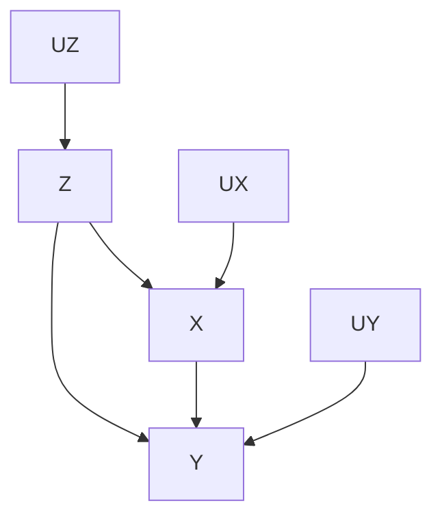
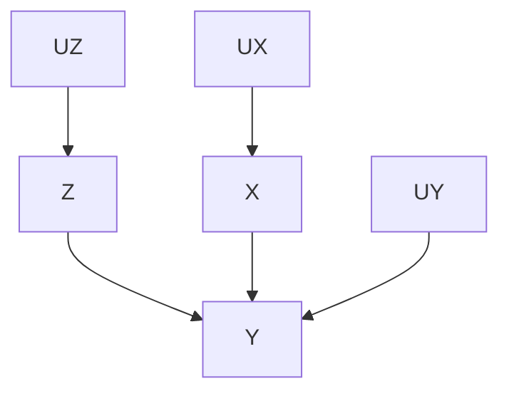

## 3.1 Inteventions
- The randomized control experiment is the gold standard to investigate whether a variable causes another variable. However, we cannot apply this method to many practical problems.
- Difference between intervention and conditioning
    - Intervention: fix a variable's value, i.e., removing all edges directed into that variable. $P(Y=y \vert do(X=x))$
    - Conditioning: No change to the graph. Just narrow our focus to the subset of cases. $P(Y=y \vert X=x)$

## 3.2 The Adjustment Formula
- The original graph

- The manipulated graph

- $P(y=y \vert do(X=x))$ is equal to $P _ m(Y=y \vert X=x)$ on the manipulated causal graph.
- Adjustment formula: $P(y=y \vert do(X=x)) = \sum _ z P(Y=y \vert X=x, Z=z)P(Z=z)$
    - adjusting for Z, controlling for Z
- Rule 1 (The Causal Effect Rule)
    - $P(Y=y \vert do(X=x)) = \sum _z P(Y=y \vert X=x, PA=z)P(PA=z)$
- Point: When we have a causal graph, we can estimate the result of intervention (or identify causal relationships) from purely statistical data.
- Generalization of the Adjustment formula (fixing a set $X$ of variables)
    - $P(y _ 1, y _ 2, ..., y _ n \vert do(X=x)) = \prod P(y _ i \vert {pa} _ i)$
